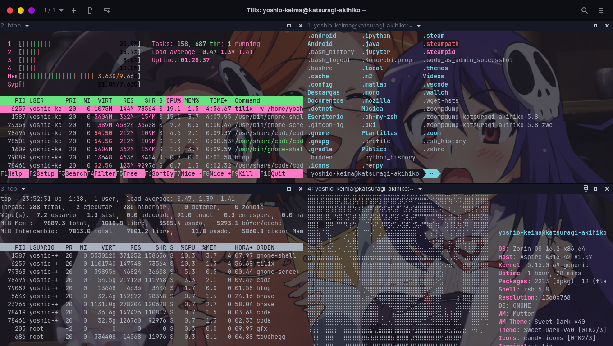
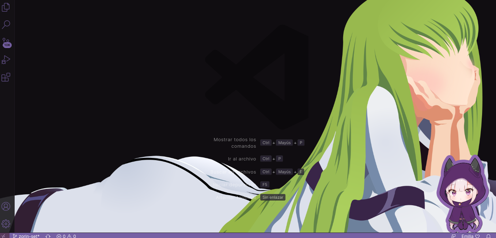

<h1 align = "center"> My-dotfiles Version The World God Only Knows 🗺️🎮❤️</h1>

  

My GNOME theme based on Linux Zorin. Main theme is The World God Only Knows of my terminal and some scripts that I have in this distro.

  

<h1 align ="center"> Main Packets on this distro. 📦</h1>

1. Wallch
2. Spotify
3. Extensions like Material icon and Doki doki theme for VS and Fix Checksums for error into VS.
4. Steam. (There are two methods).

<h1 align="center"> Wallpapers. 🖼️🎨</h1>

  

> Tilix wallpaper theme.ELise, Mari Katsuragi(Keima's mom), Haqua (Elise's friend).

  

> Christmas wallpaper with Kanon and Elise.

  

> Second wallpaper based on (汐宮栞 - Shiomiya Shiori)

<h1 align="center"> Neofetch 🎸🎤</h1>

Based on  (小阪 ちひろ Kosaka Chihiro). This is original picture, but *braille ascii art* is on directory neofetch. 

  

<h1 align="center"> Doki Doki themes VS 🖥️🖱️🎨 </h1>

Please check the documentation of this extention. Also  I included a script ([on main branch](https://github.com/JohnKun136NVCP/dotfiles/tree/main)) to allow permissions in every update of VS since it lost your wallpaper and sticker. ૮ ˶ᵔ ᵕ ᵔ˶ ა

  

<h1 align="center"> Warning ⚠️ </h1>

For install Steam may you prefer install with method 1 since anyway steam requests to install some packets more.
