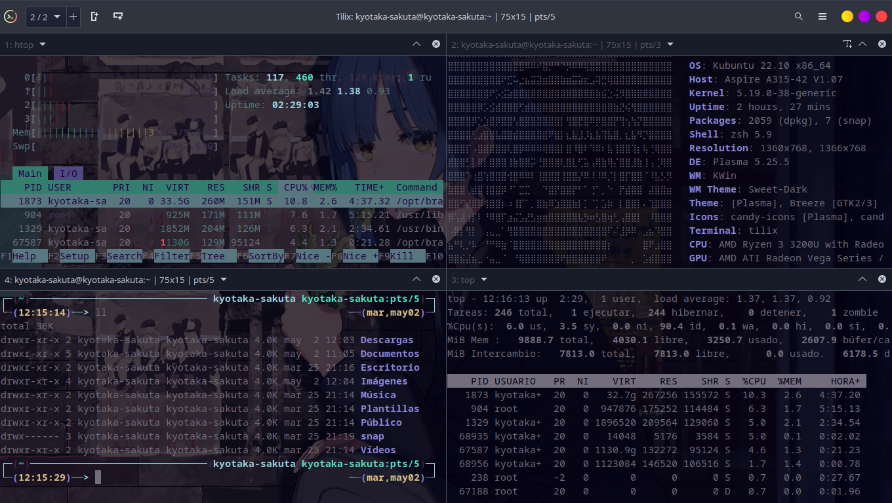
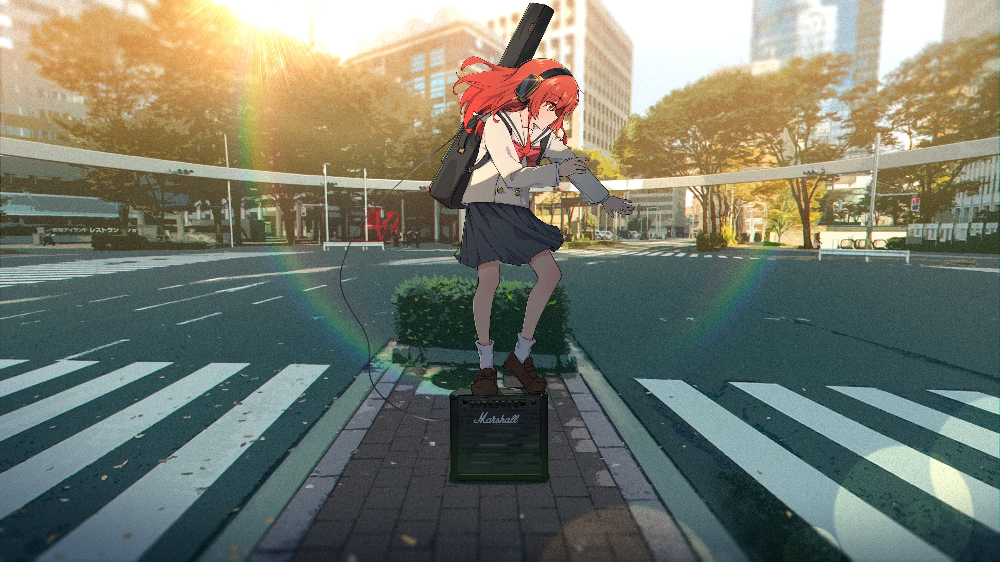
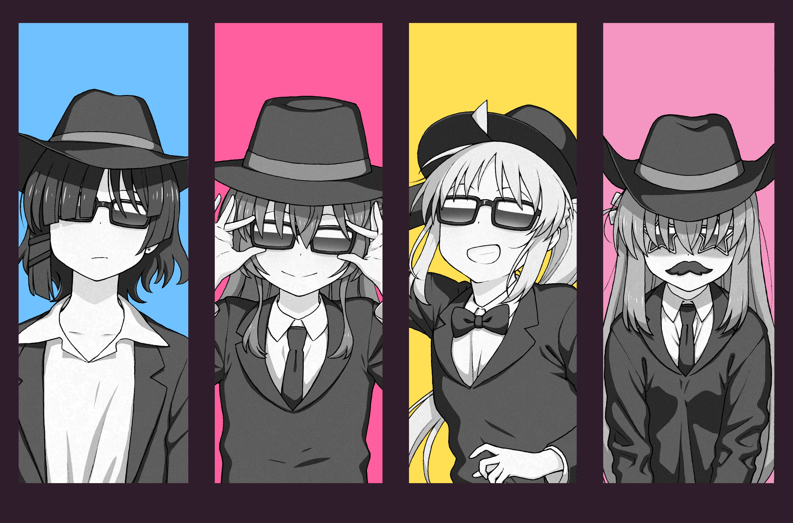
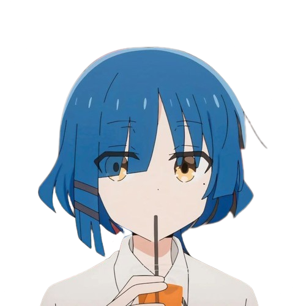

<h1 align="center">My dotfiles Version Bocchi The Rock (Ryo Yamada) 🎧🎶🎸</h1> 

    

Welcome to my dotfiles configuration (Linux based on KDE Plasma Kubuntu). Main theme is Bocchi The Rock - Ryo Yamada on main branche there are some scritps extra that I use on this distro.

    

<h1 align="center"> Main Packets on this distro. 📦</h1>
All package are up or you can dowload from [KDE look]()

1. Startup theme: *Sugar Candy for SDDM* 
2. Global Theme:  *Dark breeze* (Default theme by Kubuntu)
3. App style: *Breeze* (By default)
4. Plasma Style:  *Otto*.
5. Color: *Sweet*
6. Style of windows and icons is on main branche.
7. Cursor theme:  *Oreo Blue  Cursor*
8. Welcome screen: *Snowy Night Miku*

<h1 align="center"> Themes on terminal emulator (Gogh) 🎨</h1>
Clone the repository

    git clone https://github.com/Gogh-Co/Gogh.git

Give permissions:

    chmod +x *.sh

**Warning**: Sometimes there is a bug on some distros with gogh. Close terminal and open a new terminal and go to path you saved the repository. Finally, execute this command:

    ./gogh.sh

Sometimes, KDE plasma needs an extra package *dconf*. For install it

    sudo apt install dconf-cli

<h1 align="center"> Wallpapers 🎨🖼️</h1>

## Tilix Emultator terminal

    

## Sugar Candy for SDDM 

    

## Lock screen

    

## Wallpaper screen

    

 

<h1 align="center"> Neofetch. 🎼🎶🗒</h1>

Based on Yamada Ryo. This is original picture, but *ascii art* is on directory of neofetch.

    

 
