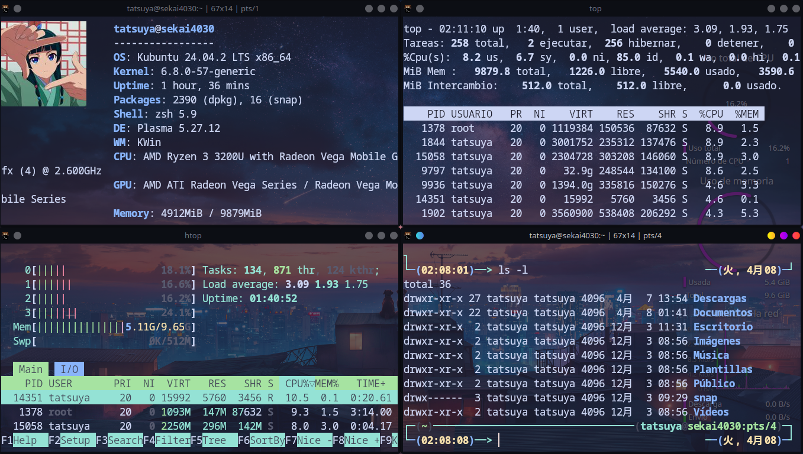
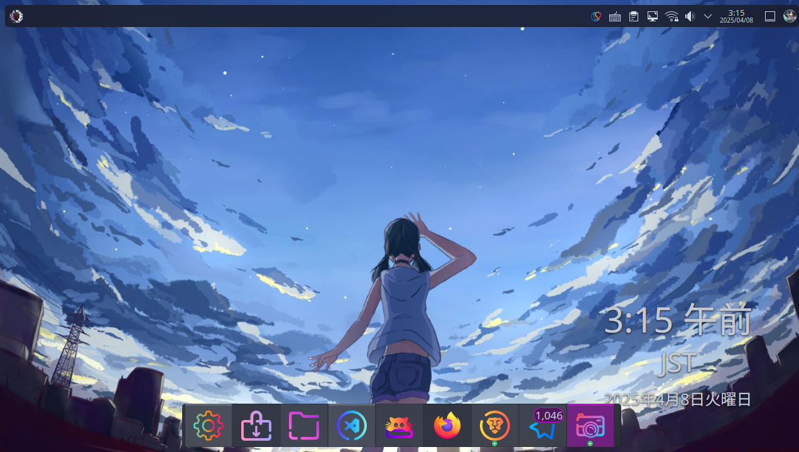
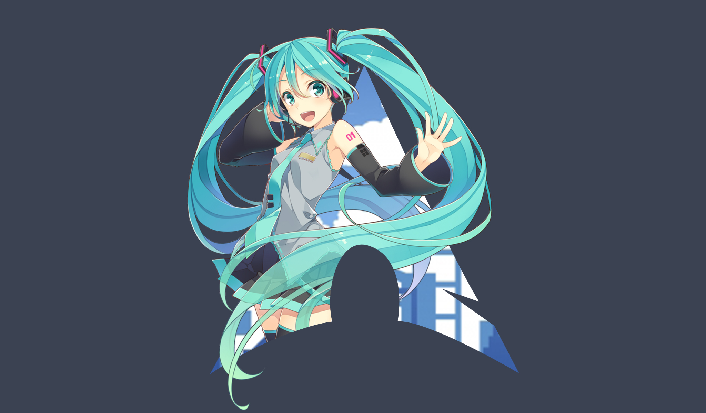

<h1 align="center">Waifus and Lofi Wallpapers (also a little of everything)</h1> 


<p align="center">
    
</p>

> Akane you're always so beautiful! Both the remake and the old version of you're incredibly cute.

Welcome to my dotfiles version (well really it doesn't exist a name for this version), anyway, *Linux based on KDE Plasma Kubuntu*. Honestly, I know the Ryo Yamada's version exist but I reinstalled again the OS (I broke it 😢😢).

On this branch I modificated totally my OS.

<h1 align="center"> Terminal Emulator (Kitty)🖥️😺</h2>

I know Neofetch is dead, however, **fastfetch** is not my best option (yet).

<p align="center">
    
</p>

Kitty is good terminal also I can put my images of my waifus xd.

```bash
sudo apt update
```
```bash
sudo apt install kitty
```
I made a script to add to menu. If you wanna do by yourself, please check the documentation on [Official Kitty documentation](https://sw.kovidgoyal.net/kitty/binary/#)

<h1> Main Packets</h1>

On this year I've started a new project (make videos). So:

1. [OpenShot Video Editor](https://www.openshot.org/es/download/)
2. [MKVToolNix](https://mkvtoolnix.download/)
3. [LMMS](https://lmms.io/download#linux)
4. [MusicScore](https://musescore.org/es/download/musescore-x86_64.AppImage)
5. [AudaCity](https://www.audacityteam.org/)

Now talking about themes. I got many troubles to install a them. So I installed using the source.
Theme: Sweet KDE
1. Download the .tar.xz on [store.kde.org](https://store.kde.org/p/1294174)
2. Uncompress .tar.gz
3. With **sudo** user.

    ```bash
    sudo mv Sweet-Dark-v40 /usr/share/themes
    ```
    ```bash
    gsettings set org.gnome.desktop.interface gtk-theme Sweet
    ```
    ```bash
    gsettings set org.gnome.desktop.wm.preferences theme Sweet
    ```

Cursors: Miku-Cursors
1. Download the .tar.xz on [www.pling.com](https://www.pling.com/p/2124099/)
2. Uncompress .tar.gz
3. With **sudo** user.
    ```bash
    sudo cp -r miku-cursor-linux /usr/share/icons
    ```
    ```bash
    cd /usr/share/icons/default
    ```
    ```bash
    sudo nano index.theme
    ``` 
4. On ```index.theme``` replace the last line, ```Inherits=miku-cursor-linux```

Also, for modificate the menu display, I made this simbol

<p align="center">
    
</p>

Now when I installed the distro, I configured the language on spanish but the region was configurated on Japan.

<p align="center">
    
</p>

My others configurations for example **zsh** for this version it's on the directory zshKDE.

<h1 align="center"> SDDDM theme 🖼️</h1>

To install SDDM [*Sugar Candy*](https://store.kde.org/p/1312658). The instructions for installing is on website.

<p align="center">
    
</p>

> Hatsune Miku Arch Linux

<h1 align="center"> Change Wallpaper automatically 🖼➡️🖼 </h1>

Ok. I made a script to change wallpaper. However, you must to run it again to change directory everytime. But I didn't want to do this, so I made a daemon to change wallpaper every minute.

1. Create the configuration file (not necessary root permissions)
```bash
nano  ~/.config/systemd/user/changewallpaper.service
```
On **changewallpaper.service** copy and change the parameters:

```bash
[Unit]
Description=Change wallpaper of KDE desktop
After=network.target

[Service]
ExecStart=/bin/bash /home/youruser/pathScript/wallpaperKDE.sh /home/youruser/DirectoryOfYouWallpapers/
Restart=on-failure
StartLimitIntervalSec=60
StartLimitBurst=5

[Install]
WantedBy=default.target
```
2. Create the timer configuration (not necessary root permissions)
```bash
nano  ~/.config/systemd/user/changewallpaper.timer
```
On **changewallpaper.timer** copy and change the parameters:
```bash
[Unit]
Description=Change wallpaper every minute

[Timer]
OnUnitActiveSec=1min
OnBootSec=1min

[Install]
WantedBy=timers.target
```
3. Reload all user daemons.
```bash
systemctl --user daemon-reload
```
4. Enable ```changewallpaper.service``` and ```changewallpaper.timer```
```bash
systemctl --user enable changewallpaper.service
```
```bash
systemctl --user enable changewallpaper.timer
```

Also I'll include the configurations on ```scriptsKDE/Changewallpaper```

So I made a script using bash and Python. I suggest you to use bash script.

> [!IMPORTANT]  
> ONLY WORKS FOR KDE PLASMA.

<h1 align="center"> Extra </h1>

# Talking about Neofetch

Neofetch configuration will be on ```scriptsKDE/Neofetch/config.conf```. Just **change the directory of you pictures**

I know Neofetch development was discontinued. But in my opinion, Neofetch is easier to use than Fastfetch (also I don't like to work with JSon files). So until Fastfetch will be easy to use I'll continue to use Neofetch.

Now my waifus collection is on ```Wallpaper/NeofetchIcons.zip```
About my wallpapers, it will be on same directory but the same is ```desktopwallpapers.zip```

# Welcome Sound
I made a script to give you a welcome you when you computer stars (like windows). So I modificated the script I've made before and change the names of sounds. It's funny.

1. Install MPV
```bash
sudo apt-get install mpv
```
2. Create a subdirectory on Documents, and name it ***startedSound***. And save there the script and the files audios.
3. Make sure that script has excecution permissions.
4. Modificate your startup to the path of the script ```startsound.sh```


<h1 align="center"> Thank you❤️🤟 <h1>


Enjoy it and please if you liked my OS configuration, please give a ⭐️, Forked 🍴, and follow me on my GitHub. If you want to support me please you can **buy a coffe** or directly you're able to become my sponsor 💖.


<p align="center">
    
</p>