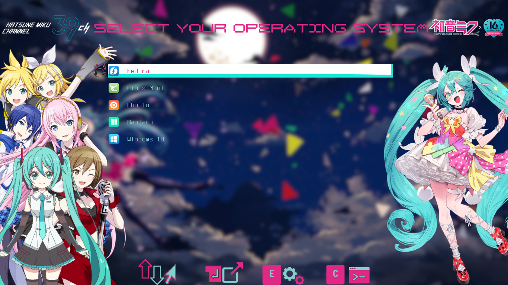

<h1 align="center">My dotfiles 📂🗃️</h1> 


Welcome to my dotfiles configuration (Linux based on Ubuntu). Here will fine my main configuations in every distro as Grub configurations, coulor icons, some scripts, Grub theme and some colours terminal.

New features about this.
1. On 829a80873024e11ab4644ce5c433a27701841da9 I was using Tilix however actually I don't.
2. Changed some scripts and new features. Please some scripts Will not be able because some of theme are a troubleshooting on new updates.


<p align="center">
    
</p>

> 猫猫 (マアマオ) (*maamao*). She's really smart. My great admiration for her.

<h1 align="center"> New Updates ✨🆙♨️ </h1>

<p align="center">
    
</p>

> Sky blossom Anime Girl 


Actually my desktop is on based from the branch [Kubuntu-KDE](https://github.com/JohnKun136NVCP/dotfiles/tree/Kubuntu-KDE)

Then new features (By branch):

| Branch/ OS | Kitty Terminal | Tilix Terminal | Gogh |Grub Theme| Other Features (not over 1 year) |Name of version (On use?)|
|:--:|:--------:|:---------:|:---:|:----:|:---:|:--:|
|Kubuntu-KDE/Kubuntu| ✅| 🚫|🚫|[Hatsune Miku](https://github.com/JohnKun136NVCP/GRUB-Theme/tree/master/Hatsune%20Miku)|✅ f3acb0d|Waifus 1.0 ✅|
|KDE-plasma-set/Kubuntu| 🚫|✅|✅|[Touhou Project](https://github.com/JohnKun136NVCP/GRUB-Theme/tree/master/Touhou%20Project)|🚫 cb7d804|Bocchi The Rock (Ryo Yamada) 🚫|
|ubuntu-set/Ubuntu| 🚫|✅|✅|[TQQ(Nakano Itsuki)](https://github.com/JohnKun136NVCP/GRUB-Theme/tree/master/Nakano%20Itsuki)|🚫 ba14f22|TQQ Itsuki 🚫|
|zorin-set/Zorin| 🚫|✅|✅|[Touhou Project](https://github.com/JohnKun136NVCP/GRUB-Theme/tree/master/Touhou%20Project)|🚫 55b9508|The World God Only Knows 🚫|

<h1 align="center"> Scripts 📜 </h1>

There are some scripts that it will useful.

Brave (Browser)

    chmod +x brave.sh

And run it.

    ./brave.sh

Scripts updates:
1. **Brave**: Fixed on f91492ec installation for Ubuntu/KDE updates.
2. **DDUPD**: I suggest you not use on anothers distros since maybe It will be able to break your Visual Studio Code.
3. **MVP**: Deleted. (a4340f1b)
4. **Steam**: Merged into one (aa1f06a8).

By source:
```bash
sudo ./steamInstall -S
```
By repository:
```bash
sudo ./steamInstall -R
```
5. **Wallch**: Deleted. (a4340f1b)

I made a script to install all you by package or all.


1. Permissions to execute.
```bash
chmod a+x install.sh
```
2. Run it with sudo.
The options are:
```bash
Usage: sudo ./install [--one] [--all] [--help]
--one: Install a single application.
--all: Install all applications.
--help: Show this help message.
Available applications: brave, mpv, spotify, steam, wallch
Example: sudo ./install --one brave
Example: sudo ./install --all
Example: ./install --help
```
# For old packages
- Tilix
- Gogh
- Grub Themes
- Themes and cursors

Please click [here](oldInstallations.md)

# Grub Hatsune Miku 16th



# Coming soon (Arch Dotfiles).

I'm preparating my dotfiles for my distro based on Arch (Garuda Linux with Hyprland)

<h1 align="center">Thank you ⚡ </h1>

<p align="center">
    
</p>
