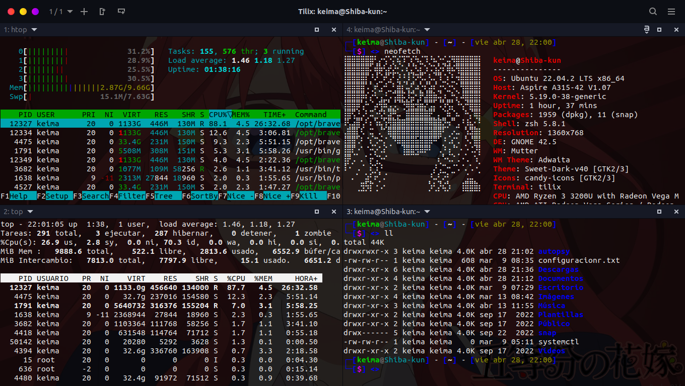
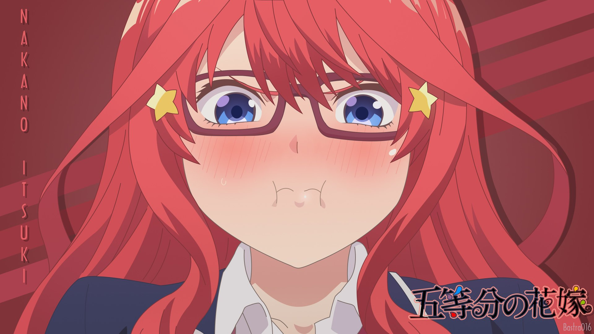

<h1 align = "center"> My-dotfiles Version The quintessential quintuplets (Itsuki) 👰🏻‍♀️❤️📕</h1>

	

My GNOME theme based on Ubuntu Linux. Main theme is The Quintessential Quintuplets - Itsuki on main branche there are some scritps extra that I use on this distro.

	

<h1 align="center"> Main Packets on this distro. 📦</h1>

1. MPV
2. Startup sound Script  depends of hour when your start your computer, i.e, if you turn on it at 0:00 until 12:00 pm, it'll play the phrase "Ohayou Gozaimasu" ([wach it](https://www.youtube.com/watch?v=hKW3RQq3aK0)). If it turns on at 12:00 until 19:00 hrs, it'll play a sound phrase as "Konichiwa" interpreted by Shinobu Kochou ([watch it](https://www.youtube.com/watch?v=fI_AcUC5uxk)). Finnaly, if it turns on at 19:00 until 0:00 hrs([wath it](https://www.youtube.com/watch?v=xffUlKFtzgI)).

<h1 align="center"> Wallpapers 🎨🖼️.</h1>

	

>Itsuki terminal wallpaper.

	

>Itsuki wallpaper.

<h1 align="center"> Neofetch. 📕✒️</h1>

Based on Nakano Itsuki. This is original picture, but *braille ascii* is on directory of neofetch.

	

<h1 align="center"> Install packets 📄 </h1>

**NOTE**: This script is important if you want to install sounds to startup own operating system.

	cd scripts/mpv-install.sh

Then give permissions:

	chmod +x  mpv-install.sh

And Run it:

	./mpv-install.sh

**Warning**: You will need to modificate .time_so.sh because this on my path, you will need to do your path. For example:

   	mpv --no-video ~/your/path/.oha.mp3

Finally,to install startup service, you will need put .time_so.sh as startup services.
